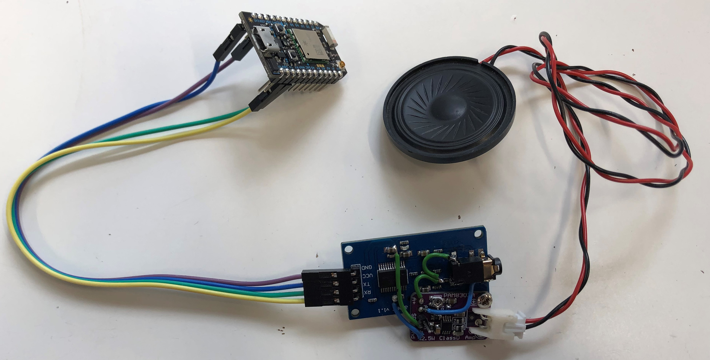
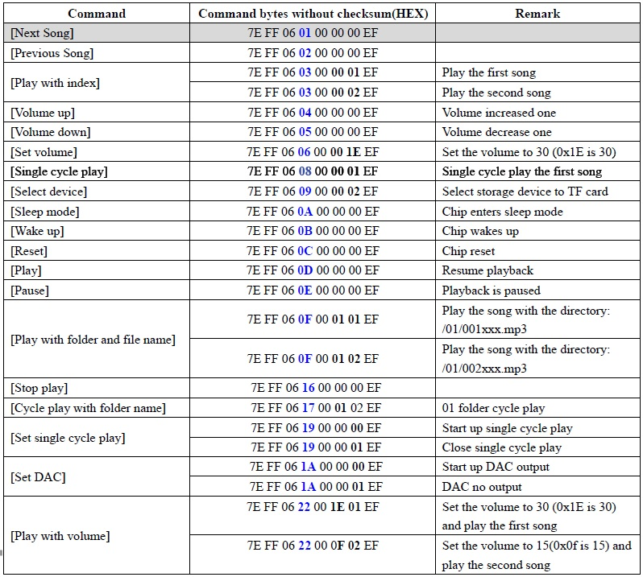
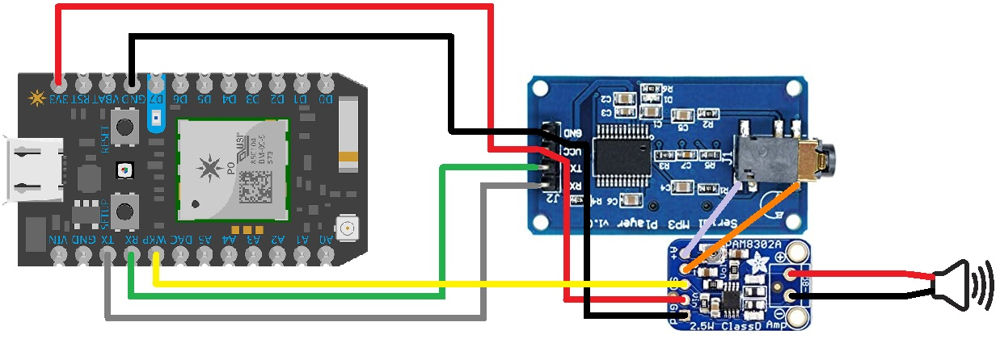
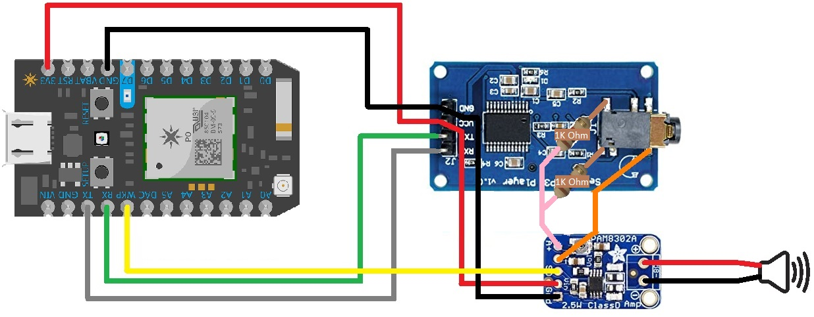

# InternetMusicPlayer
A simple IOT music player that uses a Particle Photon, and a Uart Serial MP3 Player to control music via the internet

### Notes
This project can play music using 2 methods, either directly sending a serial command to the photon, 
or via the internet by using the Particle functions, found on the particle app.

## Getting Started
### Prerequisites
This project Uses 5 or 6 items:
- [Particle Photon](https://docs.particle.io/photon/)
- [YX5300 Uart/Serial MP3/WAV Player](https://www.dx.com/p/uart-control-serial-mp3-music-player-module-for-arduino-avr-arm-pic-blue-silver-2045959.html#.XxFjpG5FyUl)
- A Micro SD Card of atleast 2G, and formatted to FAT16 or FAT32
- [Adafruit PAM8302A](https://www.adafruit.com/product/2130)
- A speaker of atleast 4 Ohms and up to 2 Watts
- (Optionally for Stereo) 2 X 1k Ohm Reistors

## Adding Music To SD Card
The MP3 player reads the .mp3 & .wav using an alphabetical index, so you need to make folders with the
names such as 01, 02, 03. As for songs, they need to be given names such 001xxxxx.mp3, 002xxxx.wav, 003xxxx.mp3.

## Communicating With Serial MP3 Player (Educational)
If you'd like to communicate directly to the MP3 Player you'd need a USB to Uart module. Set the Baud Rate to 9600, and you'd need to use Hex data that uses an 8 integer array,
Structures as: 0x7E 0XFF 0xaa 0Xbb 0X00 0Xzz 0Xyy 0XEF
Where:
- The first and the last integers are fixed with 0x7E and 0xEF values, respectively.
- 0xFF is the version number(Keep As Is).
- aa: The number of bytes of the command has, without taking into account the starting and ending byte.
- bb: is the actual control command
- zz: Feedback request command (0x00 = No Feedback, 0x01 = Feedback)
- yy: A second byte of data

The Commands are As Follows:

## Connecting Components
The Basic Connections are:
- **_1_**: Connect the 3v3 pin from the Particle Photon, to the VCC on the Serial MP3 Player.
- **_2_**: Connect a GND pin from the Particle Photon, to the GND on the Serial MP3 Player.
- **_3_**: Connect the RX pin from the Particle Photon, to the TX on the Serial MP3 Player.
- **_4_**: Connect the TX pin from the Particle Photon, to the RX on the Serial MP3 Player.
- **_5_**: Connect the WKP pin from the Particle Photon, to the SP on the PAM8302A.
- **_6_**: Connect the 3v3 pin from the PAM8302A, to the VCC on the Serial MP3 Player; or 3v3 pin from the Particle Photon or VIN pin from the Particle Photon.
- **_7_**: Connect a GND pin from the PAM8302A, to the GND on the Serial MP3 Player; or GND pin from the Particle Photon.

### Getting Mono Sound

To Get Mono Sound:

- **_1_**: Connect the A- pin from the PAM8302A, to the Gnd pin of the Audio Jack on the Serial MP3 Player. 
- **_2_**: Connect the A+ pin from the PAM8302A, to the right or left speaker pins of the Audio Jack on the Serial MP3 Player. 

### Getting Stereo Sound

To Get Stereo Sound:

- **_1_**: Connect the Right speaker pin of the Audio Jack on the Serial MP3 Player, to a leg of a 1K ohm resistor. 
- **_2_**: Connect the left speaker pin of the Audio Jack on the Serial MP3 Player, to a leg of anoter 1K ohm resistor.
- **_3_**: Connect the free legs of both 1K resistors to each other. 
- **_4_**: Connect the A+ pin from the PAM8302A, to the joint legs of both 1k resistors. 

## Uploading Code
One needs to have the Particle Photon initialised and setup to their Wi-Fi and account. Following the guide at the [Particle Website](https://docs.particle.io/quickstart/photon/).

Next, if you're using the Web IDE click on this [Link](https://go.particle.io/shared_apps/5f1fe962fb925e0016ffc581). It should open your Web IDE with all the necessary files needed.
If you're using a computer application, you can find the necessary files needed under the [InternetMusicPlayer_V2 Zip](https://github.com/saifsabban/InternetMusicPlayer/tree/master/InternetMusicPlayer_V1).

## Understanding The Particle Functions

**_01_PlayFolderSong_**: Choose a song & file to play. You can only go between 0 and 65535. Song limit 0-654, folder limit 0-99. Type as one number.

**_02_MusicState_**: Choose if you want to play, pause or stop a song. 0 = Pause, 1 = Play, 2 = Stop. Or type in the words play, pause or stop.

**_03_SkipSong_**: Choose if you want to skip to next or previous song. 0 = Previous Song, 1 = Next Song. Or type in the words Previous, or Next.

**_04_Volume_**: Choose what volume level you want, you can only go between 0 and 100.

**_05_Cycle_**: Choose if you want to cycle the current folder. 0 = Stop Cycle, 1 = Allow Cycle.

**_06_SpeakerState_**: Choose if you want to enable or disable speaker. 0 = Disable Speaker, 1 = Enable Speaker.

**_07_MP3PlayerState_**: Choose if you want to have player go to sleep, wakeup, or reset. 0 = Sleep, 1 = Wake, 2 = Restart. Or type in the words Sleep, Wake or Restart.

**_08_PlaySong_**: Choose what song you want to play from current file. You can only go between 0 and 255. (Needs Fixing)

**_09_PlayFolder_**: Choose a file & play the first song there. You can only go between 0 and 255. (Needs Fixing)

**_10_Restart_0_**: Restarts Particle Photon, type; Yes Or 0.

## Understanding The Particle Variables

**_1_Music_**: Shows what state music is at Playing, Paused, or Stopped.

**_2_VolLevel_**: Shows Current Volume Level.

**_3_CycleState_**: Shows Current Cycle State. 0 = Stopped Cycle, 1 = Cycling.

**_4_SpeakerState_**: Shows Current Speaker State. 0 = Disabled Speaker, 1 = Enabled Speaker.

**_5_PlayerState_**: Shows Current MP3 Player State. 0 = Sleeping, 1 = Awake.

**_6_Song_**: Shows Current Song.

**_7_Folder_**: Shows Current Folder.
